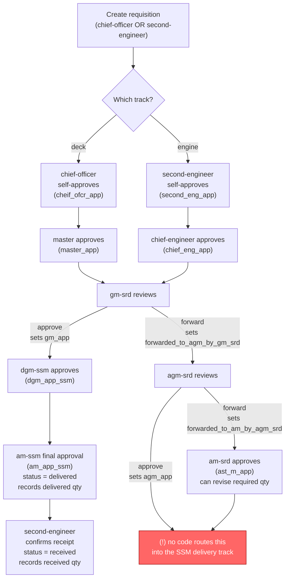

# BSC — Vessel Item Requisition System — Codebase Overview

Laravel monolith for managing a shipping company's fleet (vessels), their regulatory
surveys/certificates, and a multi-department stores **requisition** (item ordering)
workflow that runs from ship to shore.

## Tech stack

- **Backend**: Laravel 11, PHP ^8.2, `laravel/ui` (classic Blade auth scaffolding), `intervention/image` for uploaded photo/signature handling.
- **Frontend**: Blade templates + jQuery/Bootstrap 4 + Vue 2 (installed via `laravel-mix`, but not heavily used), SweetAlert2, Zebra Datepicker, Flot/Chart.js for dashboard charts.
- **DB**: MySQL (see `database/migrations`), no `.env` committed values inspected. Two big SQL dumps at repo root (`ennvisio_srd.sql`, `vesselitemreq.sql`) look like production data snapshots.
- **Auth**: Laravel's built-in `Auth::routes()` (login/register/reset/verify) — see `app/Http/Controllers/Auth/*`.
- **Testing**: PHPUnit scaffolding only (`tests/Feature/ExampleTest.php`, `tests/Unit/ExampleTest.php`) — no real test coverage exists yet.
- Note: `.upgrade-backup/` is a snapshot of the app pre-upgrade (Laravel version bump artifact) — not live code.

## Module map

| Module | Models | Key Controller methods | Purpose |
|---|---|---|---|
| **Auth** | `User`, `Role` | `Auth\*Controller` | Login/register/reset/verify. Each `User` has one `Role` (department, job title, assigned vessel). |
| **Vessel master data** | `Vessel`, `VesselParticular`, `FrameworkDescription`, `Dimension`, `Engine`, `Boiler` | `HomeController@storeVesselGenInfo/storeVessParticularDetail/storeVessFramDescription/storeDimension/storeEngine/storeBoiler`, `editVessel`, `viewVesselDetail`, `deleteVessel` | Multi-step vessel profile form: general info → particulars (IMO, flag, GRT/NRT…) → framework/description → dimensions → engine → boiler. |
| **Survey & Certificate** | `Survey`, `Certificate`, `VesselSurvey`, `VesselCertificate` | `HomeController@getSurvey/storeSurvey/updateOneSurvey/deleteOneSurvey`, same pattern for certificates | Master lists of survey/certificate *types*, plus per-vessel dated records with uploaded copies (`images/cert_copy`) tracking expiry. |
| **Inventory catalog** | `Category`, `Item` | `HomeController@getCategory/storeCategory`, `getItem/storeItem`, `getItemsByCat` | Store categories (each with a `symbol` used in requisition numbers) and items within them, used as line items on requisitions. |
| **Requisition (Order)** | `Order`, `OrderItem`, `OrderApproval` | `HomeController@storeOrder/createOrder/getOrder/viewOrderDetail/searchOrder/addDelQty/addsingleDelQty/updateStatusByAM`, `RoleController@pendingRequisition/approvedRequisition/approveRequisition/forwardToAgm` | The core module — see full workflow below. |
| **User & Role admin** | `User`, `Role` | `HomeController@getUser/storeUser/updateOneUser/deleteUser` | Admin screen to create users, assign a `role` string, a `user_type` (`ship`/`srd`/`ssm`), and (for ship roles) a `vessel_id`. |
| **Trash / soft-delete** | any model with `status`/`ord_status` boolean | `HomeController@allTrash/restore/permanentDelete` | The app doesn't use Eloquent `SoftDeletes`; it flips a boolean `status` (or `ord_status` on `Order`) to `false` and lists those rows as "trash". |
| **Profile** | `User` | `HomeController@getProfile/changePassword/changeFile` | Self-service password/photo update. |

Almost all business logic lives in **`app/Http/Controllers/HomeController.php`** (1,258 lines — a "god controller" covering vessels, surveys, certificates, categories, items, users, trash, and part of orders) plus **`RoleController.php`** (the requisition approval state machine). There's no service layer or repository pattern — controllers talk to Eloquent models directly.

## Roles / departments

`Role.user_type` is one of:
- `ship` — crew on board a vessel. `Role.role` here is one of: `second-engineer`, `chief-officer`, `chief-engineer`, `master`.
- `srd` — a shore department. `Role.role`: `am-srd`, `agm-srd`, `gm-srd`.
- `ssm` — another shore department. `Role.role`: `dgm-ssm`, `am-ssm` (an `agm-ssm` role exists in the schema/comments but its approval branch is currently commented out/disabled in `RoleController`).
- plus `super-admin` (full visibility, e.g. sees all orders in `HomeController@getOrder`).

Only `chief-officer` and `second-engineer` can **create** a requisition — enforced by the `member` middleware group in [routes/web.php](routes/web.php) wrapping `/order/store` and `/create/order`, backed by `app/Http/Middleware/MemberMiddleWare.php`.

## Requisition — full step-by-step workflow

The `orders` table holds one row per requisition; `order_items` holds its line items; `order_approvals` is a single wide row per order with one nullable "approver id" column per approval stage — the workflow is driven entirely by which of those columns is null/non-null (no explicit state machine/enum).

1. **Create** — `chief-officer` or `second-engineer` (on a specific vessel) opens `/create/order` and submits `/order/store` (`HomeController@storeOrder`):
   - Picks a `Category`, port name, and item/qty lines.
   - Generates `req_no` as `DK/{category-symbol}/{sequence}/{year}` (sequence counts existing active orders for that vessel+year).
   - Creates `Order` (`status = 'ready'`, `ord_status = true`), one `OrderItem` per line, and one blank `OrderApproval` row (all approver columns `null`).

2. **Ship-side approval, stage 1 (self-submit)** — the creator calls `/order/approve` (`RoleController@approveRequisition`):
   - `chief-officer` → sets `order_approvals.cheif_ofcr_app`, `order.status = "approved by chief-officer"`.
   - `second-engineer` → sets `order_approvals.second_eng_app`, `order.status = "approved by second-engineer"`.
   - These are two parallel tracks — which one runs depends on who created the requisition (deck items via chief-officer, engine items via second-engineer).

3. **Ship-side approval, stage 2** —
   - `master` approves requisitions where `cheif_ofcr_app` is set and `master_app` is null → sets `master_app`, status `"approved by master"`.
   - `chief-engineer` approves requisitions where `second_eng_app` is set and `chief_eng_app` is null → sets `chief_eng_app`, status `"approved by chief-engineer"`.

4. **Shore-side, SRD department** (visible once `master_app` or `chief_eng_app` is set):
   - `gm-srd` (General Manager) reviews first. Can either **approve** (sets `gm_app`, status `"approved by srd-general-manager"`) or **forward** via `/order/forward` (`RoleController@forwardToAgm`, sets `forwarded_to_agm_by_gm_srd`, status `"... forwarded to Asst. General Manager (srd) by General-manager (srd)"`).
   - `agm-srd` (Asst. General Manager) reviews requisitions forwarded by `gm-srd`. Approves (sets `agm_app`) or forwards again (sets `forwarded_to_am_by_agm_srd`).
   - `am-srd` (Asst. Manager) reviews requisitions forwarded by `agm-srd`. Approves (sets `ast_m_app`, status `"approved by srd-assistant-manager"`) — at this stage the AM can also revise the **required quantity** per line via `/item-qty/update` or `/single-qty/update`.

5. **Shore-side, SSM department (final approval + delivery)**:
   - `dgm-ssm` (Deputy GM) approves once `gm_app` is set → sets `dgm_app_ssm`, status `"approved by ssm-deputy-general-manager"`.
   - `am-ssm` (Asst. Manager) gives the final approval → sets `am_app_ssm`, `order.status = "delivered"`, `order.deliver_date = now()`. This role also records **delivered quantity** per line (`del_item_qty`).

6. **Receipt confirmation (back to ship)** — once `status == 'delivered'`, the original `second-engineer` confirms receipt through the same `/order/approve` endpoint (special-cased in `approveRequisition`): sets `order.status = "received"`, `order.rcv_date = now()`, and records **received quantity** per line (`rcv_item_qty`).

7. **Supporting actions available throughout**:
   - `pendingRequisition` / `approvedRequisition` (`RoleController`) drive the "inbox" each role sees — queried per-role against the `order_approvals` null/non-null combination described above.
   - `updateStatusByAM` lets an AM manually overwrite the free-text `status` string (escape hatch).
   - `searchOrder` filters by vessel, category, item, or date range.
   - Orders/items can be soft-deleted (`ord_status = false`) into Trash and later restored or permanently deleted.

### Approval chain diagram



**Plain-text version, if your viewer doesn't render Mermaid:**

```
Create requisition (chief-officer OR second-engineer)
        │
        ├─ deck track ──► chief-officer self-approves ──► master approves ─────┐
        │                                                                       │
        └─ engine track ► second-engineer self-approves ► chief-engineer approves ┤
                                                                                  ▼
                                                                          gm-srd reviews
                                                                          │            │
                                                                    approve         forward
                                                                          │            │
                                                                          ▼            ▼
                                                                    dgm-ssm       agm-srd reviews
                                                                    approves      │            │
                                                                          │  approve         forward
                                                                          │      │            │
                                                                          │      ▼            ▼
                                                                          │  (no further   am-srd approves
                                                                          │   routing       (can revise
                                                                          │   found)        required qty)
                                                                          │      │            │
                                                                          │      └─────┬──────┘
                                                                          ▼            ▼
                                                                    am-ssm final     (dead end —
                                                                    approval          see note below)
                                                                    status=delivered
                                                                          │
                                                                          ▼
                                                            second-engineer confirms receipt
                                                                    status=received
```

**Important gap:** only the `gm-srd → dgm-ssm → am-ssm` path actually reaches delivery in the code. The `agm-srd`/`am-srd` sub-approval branch (taken when `gm-srd` forwards instead of approving) has no corresponding `pendingRequisition` query in `RoleController` that picks the order back up for `dgm-ssm`/`am-ssm` — their queries only key off `gm_app`, never `agm_app` or `ast_m_app`. So requisitions that go down the forward-to-agm-srd route currently appear to stall after `am-srd` approves, unless there's routing logic elsewhere not yet located. Some legacy/half-finished branches (e.g. an `agm-ssm` approval step) are also commented out in `RoleController`.

## Known rough edges (worth knowing before extending this code)

- `HomeController` is a 1,258-line god-object; no service/repository layer.
- The requisition state machine is implicit — encoded as nullability of 9 columns on `order_approvals` plus a free-text `status` string, rather than an enum or a proper status/state table. Several branches in `RoleController` are commented out (e.g. `agm-ssm`), signaling in-progress/abandoned work.
- "Soft delete" is hand-rolled via boolean flags (`status`, `ord_status`) instead of Laravel's `SoftDeletes` trait.
- No real automated test coverage.
- `.env`, `Archive.zip`, and full SQL dumps are committed to the repo root — worth checking these aren't meant to be gitignored/secrets before pushing anywhere.
